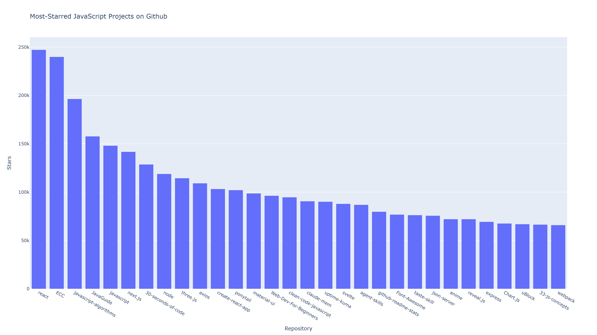

# Most-Starred JavaScript Repositories

This Python project retrieves live GitHub repository data using the GitHub REST API and creates an interactive Plotly bar chart of popular JavaScript repositories.

## Author

Alberto Medina

## Project Purpose

The purpose of this project is to practice:

- Sending requests to a live web API
- Parsing JSON response data
- Extracting repository information
- Creating clickable repository links
- Adding repository descriptions to hover labels
- Visualizing API results with Plotly
- Exporting charts as interactive HTML and static PNG files

## Data Source

Repository data is retrieved from the [GitHub REST API](https://docs.github.com/en/rest/search/search#search-repositories).

The program searches for JavaScript repositories with more than 10,000 stars and orders the results by star count.

Because the program uses live API data, repository names and star counts may change each time it runs.

## Project Files

- `Lab17_amedina6-2.py` — Main Python program
- `javascripts_repos.html` — Interactive Plotly visualization
- `javascripts_repos.png` — Static visualization preview
- `requirements.txt` — Python dependencies
- `README.md` — Project documentation

## Visualization



## Technologies

- Python
- Requests
- GitHub REST API
- JSON
- Plotly Express
- pandas
- NumPy
- Kaleido

## Installation

Clone the repository:

```bash
git clone https://github.com/a1990alpalo/Lab6_Github_repos.git
cd Lab6_Github_repos